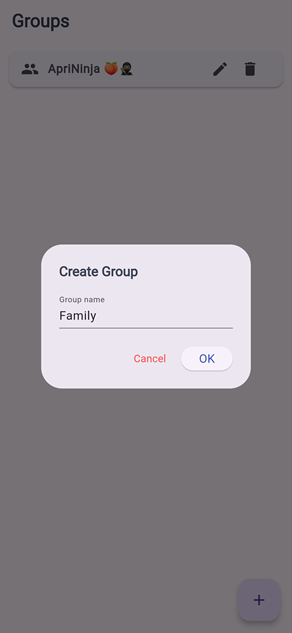
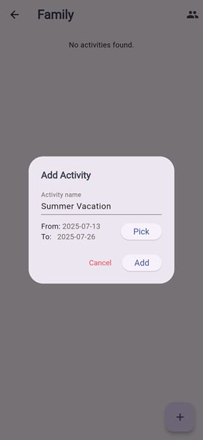
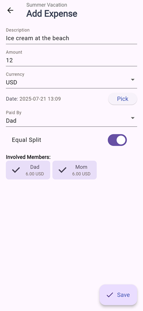
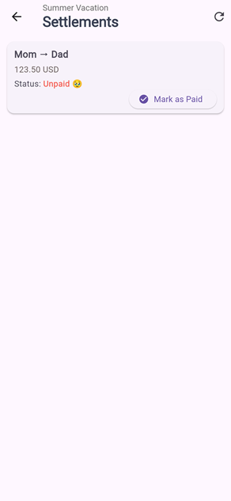

# Mouni

A lightweight app for group expense management meant to be self-hosted.

- [Backend](./backend/README.md) built with `Python` and `FastApi` spec first.
- [Frontend](./frontend/README.md) with `dart` (Flutter, web)

## Build and run locally

First build it `./docker-build-local`

Then run it `./docker-run-local`

Access it through `http://localhost:5000`

If you wish to expose it to your whole LAN network, you can `MOUNI_HOST="<your host LAN IP>" ./docker-run-local` and then assuming your host allows inbound connections through port `8080` (API) and `5000` (Frontend), people on your network can access Mouni on `http://<your host LAN IP>:5000`.

